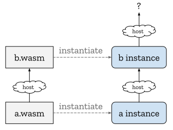
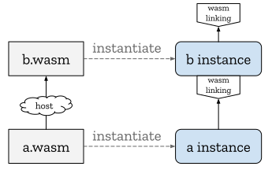

# Linking

This document outlines a future proposal that would extend the present 
[Interface Types proposal](../Explainer.md) to allow WebAssembly modules
to define how their own [instances] and their dependencies' instances are
created and linked together. This extension is not proposed as part of the
initial Interface Types release, but rather as a potential follow-up. The
reason to discuss it earlier is that the motivating use cases for this proposal
have come up enough in separate contexts that it's useful to work on the broad
strokes early and align efforts.

1. [Motivation](#motivation)
1. [Is first class instantiation the answer?](#is-first-class-instantiation-the-answer)
1. [Linking via Interface Types](#linking-via-interface-types)
1. [Use Cases Revisited](#use-cases-revisited)
1. [Non-GC / AOT Embeddings](#non-gc--aot-embeddings)
1. [ESM-integration and Linking](#esm-integration-and-linking)


## Motivation

Currently in WebAssembly, if a module `a.wasm` contains an import
`(func (import "b" "x"))`, the way in which the [module name] `b` and the field
name `x` are resolved to a function is entirely host-defined. For example, with
the [JS API], the module name is just used as a property name string, looked up
in an [import object].

If the module name `b` gets resolved by the host to some WebAssembly module
`b.wasm`, the way in which `b.wasm` is instantiated is also entirely
host-defined. This includes what imports are passed to `b.wasm` and whether the
`b.wasm` instance is created anew for `a.wasm` or shared with other.

Overall, this double layer of host-definedness can be visualized with "host"
bubbles on the links between modules and instances:

<p align="center"></p>

Without specifying a module namespace, which is outside the scope of this proposal
and, perhaps, the WebAssembly specification in general, we can't expect to
eliminate the host-defined behavior of resolving a module name to a module.
However, after this one host-defined resolution step, there is no reason that
the subsequent instantiation can't be entirely defined by WebAssembly.

Thus, the goal of this "wasm linking" proposal is to allow (but not require)
the replacement of the "host" bubbles between instances with something
WebAssembly-defined:

<p align="center"></p>

On first glance, specifying instantiation may seem like a trivial matter of
spec engineering. However, there are 3 interesting use cases, described next,
that suggest that a more general, expressive approach is required.

### "Command" modules

If, e.g., a C program with a `main()` function is compiled to a wasm module,
and the `main()` function is exported (directly, or indirectly via some
exported wrapper function), the natural way to instantiate the module is once
each time `main()` is called. Otherwise, if a single instance is created and
has `main()` called on it multiple times, fundamental program assumptions may
be broken. In general, programs are often architected to either be run as
single-shot *commands* (run from a command-line or shell script) or 
[daemons]/services (run in the background and responding to a dynamic sequence
of calls), and it can be hard to convert from one architecture to the other.

Moreover, creating and destroying short-lived instances can more eagerly
release memory to the system, reduce fragmentation and avoid a certain class
of leaks and bugs. This matches the "many small Unix processes" style of program
design, but with lower overhead due to wasm instances being lighter-weight than
OS processes.

Lastly, command modules should themselves be able to import and call other
commands modules, similar to how POSIX processes can recursively spawn and
wait on child processes (via `system()` et al). The desired instantiation
pattern is illustrated below with `clang` and `make` as command modules.

<p align="center"></p>

This use case rules out any scheme that forces instantiation to happen eagerly
or at most once for a given module.

### "Shared-everything" (dynamic) linking

The principle behind [shared-nothing linking] is that, since it's difficult and
error prone to get unrelated toolchains and languages to share low-level state,
like linear memory and tables, such low-level state should be encapsulated by
the module by default, with data copied at interface boundaries (enabled and
optimized by Interface Types).

However, many C/C++/Rust libraries cannot be factored into shared-nothing
modules, either due to fundamental dependencies on sharing low-level state
with the client or practical reasons like performance or difficulty refactoring.
By default, such libraries are currently [statically-linked] into a containing
wasm module. However, this can potentially lead to significant code duplication
so [dynamic linking]  (or, for symmetry, "shared-everything" linking) can be
useful to the code duplication of static linking.

A challenge with shared-everything linking is to control which instances
share which memory. In particular, it should be possible to write a "main"
module (the equivalent of a native `.exe`) that creates its own private memory,
explicitly shares it with N other "side" modules (the equivalent of native
`.dll`s), but encapsulates the memory from all other modules, so that the use of
shared-everything linking is kept an implementation detail from the point of
view of the main module's clients.

In particular, it should be possible to use the wasm linking proposal to achieve
the following configuration of instances:

<p align="center"></p>

Here, `libc.wasm` is specially chosen by the toolchain to define and export
memory (along with memory-management functions like `malloc`). Both `zip.wasm`
and `img.wasm` make their own new, private intsances of `libc.wasm` and then
each respectively instantiates `libm.wasm`, explicitly passing the private
`libc.wasm` instance to `libm.wasm` as an import. If neither `zip.wasm` nor
`img.wasm` export memory, then, from the perspective of `app.wasm`, they are
just two shared-nothing modules and, in the future, `img.wasm` can change its
version of `libc.wasm`, or its language/toolchain entirely and `zip.wasm` and
`app.wasm` will be unaffected. In contrast, `img.wasm` and `libm.wasm` have to
agree more intimately on the toolchain or ABI used to avoid clobbering each
other in their shared memory and tables.

### Link-time virtualization

When using an imperative instantiation API like the [JS API], the imports of the
being-instantiated module appear as explicit parameters supplied by the
instantiating code. This has several useful properties that any wasm
linking proposal should preserve:

First, it supports applications that wish to adhere to the [Principle of Least Authority],
passing modules only the imports necessary to do their job.

Second, it enables client modules to fully or partially virtualize the imports
of their dependencies without extraordinary challenge or performance overhead.
For example, if a module imports a set of file operations to operate on the file
handles it receives in its interface, and a client wants to reuse this module
on a system without builtin file I/O, the file operations and handles can be
virtualized with an in-memory implementation. Thus, if virtualization is
well-supported and efficient, software reusability and composability is
increased.

In fact, virtualization also enhances the ability to implement the Principle of
Least Authority, by allowing a client module to not only pass *subsets* of
capabilities, but also pass capabilities that are dynamically *attenuated*,
applying additional policies at runtime to reduce the granted authority.

To support these use cases, therefore, it's important that a wasm linking
proposal fully supports *link-time virtualization*. For example, it should be
possible to use wasm linking to achieve the following configuration of
instances:

<p align="center"></p>

Here, `parent.wasm` imports a `wasi:file` instance (not indicating a specific
module, just importing *some* instance implementing the `wasi:file` interface)
and passes this `wasi:file` instance on to instantiate `attenuate.wasm`.
`attenuate.wasm` applies its attenuation policy to implement the same
`wasi:file` interface which can thus be passed to instantiate `child.wasm`.
Critically, `child.wasm` has no way to get a hold of the original `wasi:file`
instance, without it being explicitly given.


## Is first-class instantiation the answer?

Given the above varied use cases, one might ask if we should simply define
an imperative instantiation API (analogous to the [JS API], but not
JS-specific), which would clearly enable the above use cases and many more.
Indeed, first-class instantiation has already been discussed 
[in the context of the reference-types proposal][host-references] and it seems
quite likely to be added to wasm at some point in the future.

One problem with a first-class instantiation API is that it fundamentally
depends on GC. The reason is that, by containing mutable reference cells
(globals and tables), wasm instances can participate in arbitrary cyclic graphs
that require some form of GC (or cycle collection) to collect. As a general
rule, WebAssembly standardization avoids creating any hard dependencies on GC
(for anything outside the [GC proposal]). This choice is essential to the high
degree of embeddability of wasm, allowing GC support to be optional on hosts
that need a small footprint.

Another goal, specific to linking, is that linking should be declarative enough
to allow:
* webpack-style fusion of multiple linked wasm modules into a single wasm
  module (using [multi-memory], to keep the source modules' memories
  independent);
* full Ahead-of-Time compilation of a linked module graph into a
  native binary, optimizing aggressively based on whole-program knowledge.

On the other end of the spectrum from the JS API, [ESM-integration] 
(WebAssembly module integration into the ECMAScript Module system) illustrates
one possible declarative module-linking scheme: wasm linking could just
specify to "do what ESM-integration would do when all the ESMs happen to
be wasm". This would be especially nice for Web compatibility.

Unfortunately, all 3 of the above use cases fall outside of what is possible
(in general, without hacks) with current ESMs. (We'll return to ESM-integration
[below](#esm-integration).)


## Linking via Interface Types

The Interface Types proposal provides a potential midpoint between a fully
first-class instantiation API and the overly-restrictive ESM loader.
Specifically, interface adapters are programmable, but declarative enough that
all interface value producers can be statically matched with interface value
consumers. In the context of the base Interface Types proposal, this
definitions-match-uses property ensures that compound values can [always][direct-copy]
be copied directly between instances' memories. For the purposes of wasm
linking, though, this property ensures that the link-time relationship between
instances can be known statically. The rest of this section incrementally
introduces the extensions to Interface Types that enable wasm linking.
(Familiarity with the concepts and syntax in the [Interface Types Explainer] is
assumed.)


### Tweaks to the underlying Interface Types proposal

Before starting, this proposal suggests making one tweak to the base Interface
Types proposal. (If we can make that tweak, we can remove this subsection.)

For the purpose of linking, it's useful to pass around whole *instances*,
not individual exports (like functions). Currently, in both core wasm and
interface adapters, every import has two strings: a module name and a field
name. Thus, if we import N exports from a single module name, the module name is
repeated N times:
```wasm
(module
  (@interface func (import "foo" "f1") (param string))
  (@interface func (import "foo" "f2") (result string))
  ...
)
```
However, using the *instance types* defined by the [Module Types] proposal,
we can express the same module type more compactly as taking a single
instance with two exports:
```wasm
(module
  (@interface instance (import "foo")
    (func (export "f1") (param string))
    (func (export "f2") (result string))
  )
)
```
This factored form ends up significantly simplifying a number of aspects of the
rest of the linking proposal.


### Module Imports

What's fundamentally missing in wasm is the ability to import (uninstantiated)
*modules*, as opposed to (already-created) *instances*. Thus, symmetric to
instance imports, wasm linking adds **module imports**:

```wasm
(module
  (@interface module (import "some_module")
    (instance (import "a")
      (func (export "b") (param s32))
    )
    (func (export "c") (param string))
  )
  ...
)
```

Walking through this module import bit by bit:

Module imports are part of the interface adapter, hence the `@interface` and
the allowed use of interface types in the contained function signatures.

Symmetric to instance imports, module imports are imported with a single module
name (here `some_module`). This name is mapped to an actual module by the
host; this proposal doesn't help define how this mapping happens; it might be
resolved using the file system, a `package.json` or something else.

As with all other imports, a module import must declare the import's type. Since
this is in the interface adapter, it imports whole instances (via an `instance`
import) instead of individual fields.

Symmetric to all other kinds of imports, module imports build a *module index
space* containing the module imports. In addition to module imports, the
module index space contains the outer containing module. If nested modules are
added to wasm in the future, they would also be present in the module index
space too.

Before we can instantiate this module, though, we need a new interface type to
describe its parameters and results.


### Instance reference types

Unlike other interface types, which classify values, since instances are
stateful (due to their contained memories, tables and globals) and thus have an
identity, they need to be passed by *reference*.

To avoid duplicating an instance type everywhere we need to refer to it, we'll
often define an instance type once, with a `(@interface type $Name (instance ...))`
definition and reference it elsewhere via `(ref `$Name)` or `(type $Name)`,
depending on the context. This is symmetric to what's possible in wasm today
to define and reuse function types ([example][func-type-example]).

This example shows an adapter function taking an instance reference parameter:
```wasm
(module
  (@interface type $I (instance
    (func (export "run") (param string) (result string))
  ))
  (@interface func (export "foo") (param (ref $I))
    ...
  )
)
```

As with the module imports described above, instance imports and the current
instance form an *instance index space*. To get a reference to any instance
in the instance index space, adapter code can use a new `ref.instance`
adapter instruction.

For example, in this example:
```wasm
(module
  (@interface type $ImportType (instance
    ... some exports
  ))
  (@interface instance $Import (type $ImportType))
  (@interface func (export "foo") (result (ref $ImportType))
    ref.instance $Import
  )
)
```
the adapter function `foo` returns its imported instance.

Another adapter instruction that takes instance references is
`call-instance-export`, which has the signature:
```
call-instance-export <string> : [(ref $I) T*] -> [U*]
```
where `$I` must be an instance type containing a function export named
`<string>` taking `T*` to `U*`.


### Instantiating modules

The big new instruction, though, is `instantiate`, which creates a new
instance of a given module. The signature of `instantiate` is:
```
instantiate <module> : [(ref (instance Iᵢ))ⁿ] -> [(ref (instance I))]
```
where `<module>` is an index or `$id` identifying a module in the module index
space and the `n` operands are statically required to match the `n` imports
of `<module>`, ignoring the module-name strings of imports and just using the
order in which the imports are declared in `<module>`'s type.

For example, in this example:
```wasm
(module $ThisModule
  (@interface type $I (instance
    ... some exports
  ))
  (@interface instance $Import (import "whatever") (type $I))
  (@interface func (export "spaw") (result (ref $I))
    ref.instance $Import
    instantiate $ThisModule
  )
)
```
the `spawn` adapter function creates a new instance, using the same import as
the original instance. `$ThisModule` has a single import, so `instantiate`
takes a single operand.

However, as this contrived example shows, `instantiate` would be significantly
limited if it could only be called from adapter functions called from
*already-created* instances. Most of the motivating use cases involve creating
and linking instances where there were none to begin with.


### Static functions

The final extension to support wasm linking is a new kind of *static* adapter
function (henceforth abbreviated to "static function") that can be called
given only a module, not an instance.

Using a static function, the following module is able to both instantiate itself
and immediately call an `init` function to finish initialization, passing an
argument (overcoming the nullary limitation of [start functions]).
```wasm
;; one.wasm
(module $ThisModule
  (func (export "init") (param i32 i32) ...)
  (@interface func (export "use") (result string) ...)
  (@interface static func (param $p string) (result instanceref)
    instantiate $ThisModule
    dup
    (call-instance-export "init" (string-to-memory (local.get $p)))
  )
)
```
Here, `instanceref` is a special instance reference type which is defined
to alias the containing module's instance type. This alias saves the module the
annoyance and bloat of having to re-declare its own instance type.

When a static function is defined, it's static function type *replaces* the
ordinary module type so that the *only* way to instantiate the module is by
calling the static function. We call this new static function type the *adapted
module type*. For example, the adapted module type of `one.wasm` above is:
```wasm
(static func
  (param string)
  (result (ref (instance (func (export "use") (result string)))))
)
```

### Calling static functions

A module with a static function can be instantiated using the same `instantiate`
instruction as before; `instantiate` just checks that the operands match the
static function's parameter types (instead of the imports) and then pushes the
static function's result types (instead of the module's instance type).

To see an example, let's look at a client of `one.wasm` (from the previous
section) that uses its own static function to instantiate its `one.wasm`
dependency.
```wasm
;; two.wasm
(module $ThisModule
  (@interface type $OneInstanceType (instance
    (func (export "use") (result string))
  )
  (@interface static func $Dependency (import "./one.wasm")
    (param string)
    (result (ref $OneInstanceType))
  )
  (@interface instance (import "")
    (type $OneInstanceType)
  )
  (@interface static func (param $p string) (result instanceref)
    (instantiate $Dependency (local.get $p))
    instantiate $ThisModule
  )
)
```
Looking at the 4 definitions of this module in sequence:
* The first defines the instance type of `one.wasm`, so that it can be used
  twice below.
* The second defines a module import of `./one.wasm`, which is up to the host
  to resolve, but we'll assume does actually resolve to the above `one.wasm`
  module.
* The third defines an instance import with a `one.wasm`-compatible type.
  Because there is a static function supplying the import, the import's
  module-name string is insignificant, so empty.
* The fourth defines `two.wasm`'s static function. This function first
  instantiates the `./one.wasm` module import and uses the resulting instance
  to instantiate `two.wasm`.

From another perspective, static adapter functions are vaguely similar to
C++ static functions, with the above two wasm modules performing the
metaphorical equivalent of:

```c++
class One {
  One();
  void init(string);
public:
  static One* New(string s) {
    One* one = new One();
    one->init(s);
    return one;
  }
};

class Two {
  Two(One*);
public:
  static Two* New(string s) {
    One* one = One::New(s);
    return new Two(one);
  }
};
```

Just as C++ static functions can be used to further encapsulate the
process of fully constructing an object and its dependencies, so
too can static adapter functions.


### Static function optional parameter names

While `instantiate` passes operands based on the declared import/parameter
order, ignoring the module-name strings of imports, module-name strings can
still be useful in some contexts.

For example, the module-name of an import can be a WASI-defined string
identifying a particular requested set of capabilities:
```wasm
(@interface instance (import "wasi:file")
  (func (export "read") ...)
  (func (export "write") ...)
)
```
When a module is `instantiate`d by another module, the string `wasi:file` may
be ignored, but when a module is instantiated directly from a host, this
string is the only way to communicate to the host the semantic capabilities
being requested; the instance type alone is insufficient.

Since we must not lose this ability when using static functions, the parameters
of static functions therefore allow optional names. For example:
```wasm
(module
  (@interface type $wasiFile (instance
    (func (export "read") ...)
    (func (export "write") ...)
  ))
  (@interface static func (param "wasi:file" (ref $wasiFile))
    ...
  )
)
```

In total, the net effect of wasm linking is that imports are ultimately split
imports into two kinds: module imports and static function parameters. Module
imports form a direct reference to a particular module (after host module-name
resolution) while static function parameters are an indirect request for *some*
instance that matches a given type that is created by "someone else" (either a
parent module or the host directly).


## Use Cases Revisited

TODO

**"Command" modules**: easy
* code example

**"Shared-everything" (dynamic) linking**: so possible!
* code example

**Link-time virtualization**: also possible!
* module imports: do not grant capabilities
* static import parameters: capabilities only granted directly to root module
* revisit virtualization example, now with code


## Non-GC / AOT Embeddings

TODO: may still require GC when static functions return references and static functions
are called dynamically, but we can define a static criteria for when linking doesn't
require GC and can be AOT-compiled.


## ESM-integration

TODO: wasm linking could, in fact, be integrated


[Instances]: https://webassembly.github.io/spec/core/exec/runtime.html#module-instances
[Module Name]: https://webassembly.github.io/spec/core/syntax/modules.html#syntax-import
[start functions]: https://webassembly.github.io/spec/core/syntax/modules.html#start-function

[JS API]: https://webassembly.github.io/spec/js-api/index.html
[Import Object]: https://webassembly.github.io/spec/js-api/index.html#read-the-imports

[Interface Types Explainer]: https://github.com/WebAssembly/interface-types/blob/master/proposals/interface-types/Explainer.md
[Shared-nothing Linking]: https://github.com/WebAssembly/interface-types/blob/linking/proposals/interface-types/Explainer.md#motivation
[direct-copy]: https://github.com/WebAssembly/interface-types/blob/master/proposals/interface-types/Explainer.md#lifting-lowering-and-laziness

[host-references]: https://github.com/WebAssembly/reference-types/blob/master/proposals/reference-types/Overview.md#further-possible-generalisations
[multi-memory]: https://github.com/webassembly/multi-memory
[esm-integration]: https://github.com/WebAssembly/esm-integration
[func-type-example]: https://github.com/WebAssembly/function-references/blob/master/proposals/function-references/Overview.md#examples
[Module Types]: https://github.com/WebAssembly/module-types/blob/master/proposals/module-types/Overview.md
[GC proposal]: https://github.com/WebAssembly/gc/blob/master/proposals/gc

[daemons]: https://en.wikipedia.org/wiki/Daemon_(computing)
[Statically-linked]: https://en.wikipedia.org/wiki/Static_library
[Dynamic linking]: https://en.wikipedia.org/wiki/Dynamic_loading
[Principle of Least Authority]: https://en.wikipedia.org/wiki/Principle_of_least_privilege
