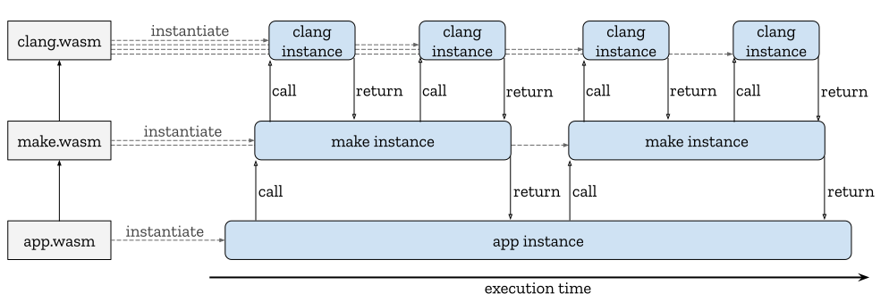
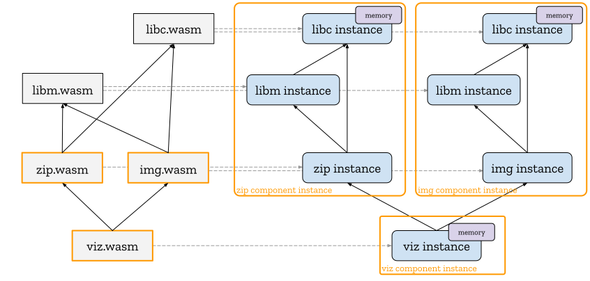
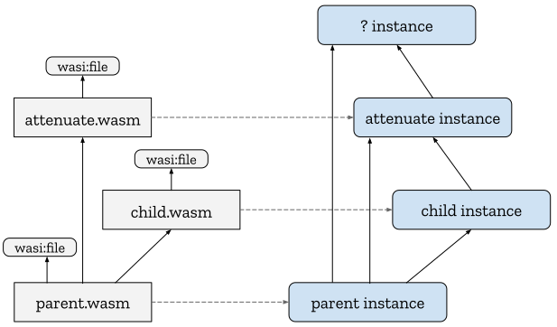

# Linking

This document describes a core WebAssembly feature, *first-class modules*,
that, when lifted into the second-class context of [Interface Types], would
enable WebAssembly modules to control how their instances and their
dependencies' instances are linked in a manner that is host-independent,
predictably optimizable and without implicit dependency on garbage collection.

While the underlying Interface Types proposal is itself still emerging, it's
useful to map out this farther-future path eagerly both because there is active
discussion around the wasm ecosystem for how to address the use cases outlined
in this proposal and because this proposal may feed back changes into the
underlying Interface Types proposal.

1. [Motivation](#motivation)
    1. [Command modules](#command-modules)
    2. [Dynamic shared-everything linking](#dynamic-shared-everything-linking)
    3. [Link-time virtualization](#link-time-virtualization)
2. [First-class modules](#first-class-modules)
    1. [Module and instance types](#module-and-instance-types)
    2. [Single-level imports](#single-level-imports)
    3. [Module and instance imports](#module-and-instance-imports)
    4. [Module and instance references and instructions](#module-and-instnace-references-and-instructions)
    5. [Nested modules](#nested-modules)
    6. [Module and instance exports](#module-and-instance-exports)
    7. [Determinate module import linking](#determinate-module-import-linking)
4. [Use cases revisited](#use-cases-revisited)
    1. [Command modules revisited](#command-modules-revisited)
    2. [Dynamic shared-everything linking revisited](#dynamic-shared-everything-linking-revisited)
    3. [Link-time virtualization revisited](#link-time-virtualization-revisited)
5. [Second-class modules](#second-class-modules)
    1. [Problems with first-class modules](#problems-with-first-class-modules)
    2. [Lifting first-class modules into the Interface Types](#lifting-first-class-modules-into-interface-types)
    3. [Reframing the Interface Types proposal in terms of nested modules](#reframing-the-interface-types-proposal-in-terms-of-nested-modules)
    4. [Declarative linking via constructors](#declarative-linking-via-constructors)
    5. [Recovering the command module pattern](#recovering-the-command-module-pattern)
6. [Use cases re-revisited](#use-cases-re-revisited)
    1. [Command modules re-revisited](#command-modules-re-revisited)
    2. [Dynamic shared-everything linking re-revisited](#dynamic-shared-everything-linking-re-revisited)
    3. [Link-time virtualization re-revisited](#link-time-virtualization-re-revisited)


## Motivation

To realize the potential of WebAssembly, it should be possible to build
reusable, composable WebAssembly components without requiring all developers to
use the same language, toolchain or memory representation (where a "component"
is one or more tightly-coupled wasm modules, in a sense to be more-precisely
defined [below](#dynamic-shared-everything-linking)). One half of this
requirement is satisfied by adopting a [shared-nothing] model wherein each
component encapsulates its own state (memory, table and globals) using
[Interface Types] and [Abstract Types] to pass values and references,
respectively, across component interface boundaries.

The remaining problem to be solved is to enable WebAssembly components to be
**linked** together in a language-, toolchain- and host-agnostic manner.
Currently in WebAssembly, if a wasm module contains an import:
```
(import "m" "f" (func ...))
```
the way in which the module name `m` and the field name `f` are resolved to a
function is entirely host-defined. Even within a single host there can be
multiple modes of resolution. For example, in a JS embedding, a module can
either be instantiated by the [JS API] or [ESM-integration]. Given all this
ambiguity, non-Web WebAssembly hosts sometimes simply don't support
wasm-to-wasm imports at all, only allowing imports from a fixed set of built-in
modules supplied by the host.

To standardize host-independent linking, obviously the [JS API] is ruled out,
but perhaps a wasm-only subset of [ESM-integration] could be defined, such
that a collection of N wasm modules could be equivalently loaded in both JS and
non-JS hosts? Such a solution would be attractive in allowing WebAssembly
modules to be seamlessly integrated into the largest existing package
ecosystem. Unfortunately, the [ESM-integration] model is not expressive enough
to support the following 3 important use cases:

### Command modules

If a C program with a `main()` function is compiled to a wasm module,
and the `main()` function is exported (directly, or indirectly via some
exported wrapper function), the natural way to instantiate the module is once
each time `main()` is called. Otherwise, if a single instance is created and
has its `main()` called multiple times, fundamental C program assumptions may
be broken. In general, programs are often architected to either be run as
`main()`-style *commands* (run from a command-line or shell script) or 
[daemons]/services (run in the background and responding to a host- or
user-defined sequence of requests) and it can be hard to convert between the
two architectures.

Moreover, creating and destroying short-lived instances more-eagerly releases
memory to the system, reduces fragmentation and avoids a class of leaks and
bugs. This is essentially the motivation for the "many small Unix processes"
style of program design, but with lower overhead due to wasm instances being
lighter-weight than OS processes.

Lastly, command modules should themselves be able to import and call other
commands modules, similar to how POSIX processes can recursively spawn and
wait on child processes (via `system()` et al). The desired instantiation
behavior over time is illustrated below with `clang` and `make` as command
modules:

<p align="center"></p>

Here, the `call`s and `return`s refer to calling an export of the instance
pointed to by the call. As shown by the "width" of the instance on the x
axis, execution time, the instance is thus created right before the export
call and destroyed right after.

*This use case rules out any linking solution that forces instantiation to happen
eagerly or at most once for a given module.*

### Dynamic shared-everything linking

The principle behind the [shared-nothing] model is that, since it's difficult
and error prone to get unrelated toolchains and languages to share low-level
state, like linear memory and tables, such low-level state should be
encapsulated by a module by default. However, many C/C++/Rust libraries
cannot be factored to share nothing, either due to fundamental dependencies on
sharing memory in the interface or practical reasons like performance
or difficulty refactoring. By default, such libraries are currently
[statically linked] into a containing wasm module. However, statically
linking *everything* leads to code duplication which is classically
addressed in native code by [dynamic linking]. In the context of wasm, we'll
call this "dynamic *shared-everything* linking" to distinguish it from dynamic
*shared-nothing* linking, both of which are possible in wasm.

A challenge with dynamic shared-everything linking is to control which
instances share which memory. In particular, it should be possible to write a
"main" module (the analogue of a native executable) that creates its own private
memory, explicitly shares it with N other "shared" modules (the analogue of
native `.dll`/`.so`s), but encapsulates its memory from all *other* modules, so
that the use of shared-everything linking is kept an implementation detail from
the point of view of the main module's clients. Thus, we want a two-level
hierarchy, where multiple same-language/ABI wasm modules are composed into a
single logical unit whose public interface is determined by its main module.
For convenience (and until a better term emerges), this explainer will refer to
this "single logical unit" as a **component**.

For example, consider the diagram below showing a component `viz` that depends
on two components `zip` and `img` which happen to share library code (`libc` and
`libm`). `viz` shouldn't need to know the implementation language of `zip` and
`img`, much less that they share library code; in the future, if `zip` uses
different libraries or a different version of the same library, `viz` shouldn't
be affected. Thus, `zip` and `img` need to be able to *privately* control how to
instantiate and link their dependencies to achieve the instance graph on the
right side of this diagram:

<p align="center"></p>

The orange rectangles on the right show the (dynamic) component instances
that are created at runtime from the orange (static) components on the left.
Note that `viz`, `zip` and `img` are components, but `libc` and `libm` are not;
they are just wasm modules that implement a particular toolchain's ABI. Thus,
the interfaces of `libc` and `libm` will use `i32` offsets into a shared linear
memory while the interfaces of `viz`, `zip` and `img` will use interface and
abstract types.

While the preceding discussion has focused on sharing linear memory for
languages like C/C++ and Rust, there will still be a need for shared-everything
linking with GC languages even after the [GC proposal]. Instead of sharing linear
memory, GC languages will need to share metadata, vtables, runtime type tags,
runtime support machinery, etc. Thus, the two-level module/component hierarchy
is essential to the wasm ecosystem.

*This use case rules out any linking solution where main modules are not able
to explicitly create and link together private instances of a language runtime
and side modules.*

### Link-time virtualization

When using a first-class instantiation API like the JS API's [`instantiate`],
the imports of the being-instantiated module appear as explicit parameters
supplied by the calling code. This has several useful properties that any wasm
linking proposal should preserve:

First, it supports applications that wish to adhere to the 
[Principle of Least Authority], passing modules only the imports necessary to do
their job. Some Web applications are already relying on this property to
sandbox untrusted plugins.

Second, it enables client modules to fully or partially [virtualize] the imports
of their dependencies without extraordinary challenge or performance overhead.
For example, if a module imports a set of file operations and a client wants to
reuse this module on a system without builtin file I/O, the file operations and
handles can be virtualized with an in-memory implementation. In general, if
virtualization is well-supported and efficient, software reusability and
composability are increased. Virtualization also enhances the ability of
developers to implement the Principle of Least Authority, by allowing a client
module to not only pass *subsets* of capabilities, but also pass [attenuated]
capabilities, where additional *runtime* policies are applied to limit granted
authority.

While it is possible to perform virtualization at run-time, e.g., passing
function references for all virtualizable operations, this approach would be
problematic as a basis for a highly-virtualizable ecosystem since it would
require modules to intentionally opt into virtualization by choosing to receive
first-class function references instead of using imports. In the limit, to
provide maximum flexibility to client code, toolchains should avoid *all* use
of imports, effectively annulling a core part of wasm. Because of their
more-static nature, imports are inherently more efficient and optimizable than
first-class function references, so this would also have a negative performance
impact.

To avoid the problems of run-time virtualization, wasm linking should therefore
enable **link-time virtualization**, such that a parent module can control
*all* the imports of its dependencies (without any explicit opt-in by the
dependency), just as with the JS API. As an example, it should be possible to
use wasm linking to achieve the following instance graph:

<p align="center"></p>

Here, despite the fact that `parent.wasm` and `child.wasm` both import the same
`wasi:file`, the parent is able to create an anntenuated version of `wasi:file`
which it passes to the child. Thus, `wasi:file` doesn't identify a single
global implementation; rather it names an *interface* which can be variously
implemented. Indeed, even `parent.wasm` doesn't know whether it received the
"system" implementation of `wasi:file` or some other implementation supplied by
another module that imports `parent.wasm` (hence the `? instance` in the
diagram). There may not even *be* a "system" implementation of `wasi:file`.
Crtically, though, there is no way for `child.wasm` to bypass `parent.wasm` in
its request for `wasi:file`.

*This use case rules out any linking solution where a module is not able to
explicitly create and supply the imports of its dependencies.*


## First-class modules

Based on the preceding use cases, it's clear something more expressive than
ESM-integration is required. While the JS API's first-class modules, instances
and instantiation functions could enable all 3 use cases, wasm of course cannot
take a universal dependency on JS. But could something similarly powerful be
added to core wasm instead? Indeed, such a feature has been under consideration
since the beginning of WebAssembly standardization. This section outlines how
such feature, which will be referred to as "first-class modules", could work
and satisfy the above use cases.

First-class modules do have some downsides, though, which will be discussed in
a subsequent section. However, these downsides can be addressed by lifting
first-class modules into the adapter layer introduced by Interface Types, which
will be discussed thereafter. In this section, though, we exclusively consider
first-class modules in core wasm.


### Module and instance types

While the feature is named "first-class modules", there are actually two
new first-class things: modules and instances. Like every other first-class
thing wasm manipulates, modules and instances have a type. The [Module Types]
proposal conveniently already aims to define the textual and abstract syntax for
module and instance types, so we reuse what is proposed there here.

Conceptually, a wasm module (that has been [decoded] or [parsed] and then
[validated]) is just a *function* that constructs module instances given a set
of parameters and so a wasm module *type* is conceptually just a *function type*.
Concretely, however, modules are defined in terms of imports and exports, where
the imports serve as the parameters and the exports describe the resulting
instance. Thus, instead of writing a module type as literally as a function
type, module types are written in terms of imports and exports and instance
types are written in terms of exports.

For example, the module:
```wasm
(module
  (memory (import "mod" "mem") 1)
  (func (import "mod" "f") (param i32) (result i32)))
  (func (export "run") (param i32 i32) (result i32) (i32.add (local.get 0) (local.get 1)))
  (table funcref 1)
)
```
has the module type:
```wasm
(module
  (memory (import "mod" "mem") 1)
  (func (import "mod" "f") (param i32) (result i32))
  (func (export "run") (param i32 i32) (result i32))
)
```
and its constructed instances have the instance type:
```wasm
(instance
  (func (export "run") (param i32 i32) (result i32))
)
```

The above module and instance types are using syntactic sugar
(defined as [abbreviations in the text format][import-abbrev]). The equivalent
desugared form, extended slightly to allow exports to be symmetric, is:
```wasm
(module
  (import "mod" "mem" (memory 1))
  (import "mod" "f" (func (param i32) (result i32)))
  (export "run" (func (param i32 i32) (result i32)))
)
(instance
  (export "run" (func (param i32 i32) (result i32)))
)
```
This desugared form will be used throughout this explainer since it will
more-naturally extend to imports/exports of interface-typed values
later on.


### Single-level imports

Before we can introduce module and instance imports, there is another change to
core wasm which will be convenient: *single-level imports*. Thus an import of
the form:
```wasm
(import "x" (func))
```
would become legal.

While not semantically required in the core wasm spec, the general idea of the
existing two-level imports is that the first name is the name of a parameter
which *implicitly* takes an instance and the second name names a field of that
instance. However, as we'll see next, when importing an instance *explicitly*,
only one name makes sense, since the field name is already part of the
instance. Thus, requiring instance imports to be two-level would end up
introducing unnecessary baggage in the common case.

While a special case could be made for instance imports, as we'll see
later when looking at the `module.instantiate` instruction, single-level
imports make sense for *all* kinds of imports. Thus, as a general extension to
wasm, imports would be allowed to provide only a single import name.

From a core wasm perspective, import names are insignificant; the
[`module_instantiate`] function just takes an ordered sequence of values. It's
only the *host embedding* that inspects a module's import strings to determine
how to materialize the sequence of import values. Thus, each host embedding
will need to determine how to interpret single-name imports.

In the case of the [JS API], the obvious interpretation of:
```wasm
(module
  (import "x" "y" (func))
  (import "z" (func))
)
```
is to expect an import object of the form:
```js
const importObj = {
  x: {
    y: () => {}
  }
  z: () => {}
};
WebAssembly.instantiate(module, importObj);
```
As a nice side effect, this allows [JS API]-using toolchains that have no
need of a two-level namespace, like Emscripten, to avoid synthesizing
otherwise-superfluous first-level names like `env`.

For [ESM-integration], single-name imports of instance/module type (shown next)
have a natural interpretation. For any other import kind, it would be possible
for a single-name import to map to the [default export], which would actually
close a slight expressivity gap of current [ESM-integration].


### Module and instance imports

The first step toward first-class modules is to allow them to be *imported*.
As with other wasm imports, a module or instance import declares the type of
the imported thing, which means embedding a module or instance type inside
an `(import)` statement.

Starting with an example instance import:
```wasm
(module
  (import "i" (instance
    (export "x" (func))
    (export "y" (func))
  ))
)
```
we can see why a single-level import makes sense. This import is essentially
equivalent to the MVP wasm module:
```wasm
(module
  (import "i" "x" (func))
  (import "i" "y" (func))
)
```
where the first-level name has been factored out. Notice that the function
*imports* in the MVP wasm module turn into *function exports* of the
imported instance.

While not strictly necessary, for convenience, size and performance, the
individual function, memory, table, global fields of imported instances would
be added into their respective [index spaces]. This would allow, e.g., calls to
imported functions or stores to imported memories to work just like they do now.

Module imports are written symmetrically. For example:
```wasm
(module
  (import "m" (module
    (import "a" (func))
    (export "x" (func))
    (export "y" (func))
  ))
)
```
Here we define a module which imports another module. The difference with
an instance import is that the containing module can control how the imported
module is instantiated. Thus, the containing module can create 0, 1 or N
instances of this imported module, supplying a different `a` import and
receiving distinct `x` and `y` exports each time. In contrast, the prior
instance import is given exactly one instance, `x` and `y` at instantiation
time.

But how do we actually go about instantiating an imported module?


### Module and instance references and instructions

Symmetric to the [function references] proposal, module and instance types can
used in reference type that can be passed around as first-class values.
To do this, the module or instance type needs to be explicitly defined in the
type section, so that it can be referenced (by type index) in a `(ref $T)` type:
```wasm
(module
  (type $I (instance
    (export "run" (func (param i32) (result i32)))
  ))
  (func $callRun (param (ref $I))
    ...
  )
)
```

Given these new module and instance reference types, we can define 3
increasingly-interesting instructions:

First, symmetric to [`ref.func`] in the function references proposal, there
are two new instructions for creating first-class module and instance references:
* `ref.instance $i : [] -> [(ref (instance $I))]`
  * iff `$i : (instance $I)` in the instance index space
* `ref.module $m : [] -> [(ref (module $M))]`
  * iff `$m : (module $M)` in the module index space

Second, given an instance reference, `instance.export` extracts a first-class
reference to one of its fields, identified statically by an index into the
ordered list of exports declared by the instance type:
* `instance.export $export : [(ref (instance $I))] -> [(ref $T)]`
  * iff the `$export`'th export of `$I` has type `$T`

For example, we can now fill in the body of the above `$callRun` function:
```wasm
(module
  (type $I (instance
    (export "run" (func $run (param i32) (result i32)))
  ))
  (func $callRun (param $i (ref $I)) (result i32)
    local.get $i
    instance.export $run
    i32.const 42
    call_ref
  )
)
```

Lastly, and the point of the whole first-class modules feature, is the
`module.instantiate` instruction:
* `module.instantiate : [(ref (module M)) Tᵢⁿ] -> [(ref (instance I))]`
  * iff `M` has `n` imports matching the operand types `Tᵢ` and exports matching `I`

Similar to direct function calls, a "direct" form of instantiate would replace the
first-class module reference with a module index:
* `module.instantiate $m : [Tᵢⁿ] -> [(ref (instance I))]`
  * iff `$m : (module M)` in the module index space

For example, we can import a module once and instantiate it with two different
imported functions:
```wasm
(module
  (import "m" (module $m
    (import "i" (func))
    (export "run" (func $run))
  ))
  (func $f1 ...)
  (func $f2 ...)
  (func $runWithBoth
    (call_ref
      (instance.export $run
        (module.instantiate $m
          (ref.func $f1))))
    (call_ref
      (instance.export $run
        (module.instantiate $m
          (ref.func $f2))))
  )
)
```
Here the module `$m` imports an individual function, but whole instances can be
imported just as well:
```wasm
(module
  (type $I (instance
    ... exports
  ))
  (import "x" (instance $x (type $I)))
  (import "m" (module $m
    (import "i" (instance (type $I)))
    (export "run" (func $run))
  ))
  (func $runWithImport
    (call_ref
      (instance.export $run
        (module.instantiate $m
          ref.instance $x)))
  )
)
```
Here, the `(type $I)` in the `import` statements is a [type use], allowing us to
reuse the type definition of `$I`.


### Nested modules

A nested module is simply a module written inside another module. Just as
function imports and definitions form a single function index space, module
imports and nested modules form a single module index space, so they can be
uniformly instantiated via `module.instantiate`. For example:
```wasm
(module
  (module $child
    (func (export "hi") (param i32) (result i32)
      ...
    )
  )
  (func (export "newChild") (result (ref (instance (export "hi" (func)))))
    module.instantiate $child
  )
)
```

Unlike most source-language nested functions/classes, nested modules have no
special access to their containing parent modules and thus can be parsed,
decoded and validated independently; nesting only provides encapsulation. In
the binary encoding, a nested module would be a sequence of bytes inside a
section of the parent module which can be decoded according to the normal
module decoding rules.

Thus, it is 100% equivalent to transform a module import that is known to
resolve to a module `X` into a nested module `X` without changing either the
text or binary format of `X`. The reverse direction is also 100% equivalent.
This is an important and unique property of module imports / nested modules
owing to the fact that a wasm module is a stateless function defined entirely
in terms of its binary/text format.

Is there also a symmetric concept of "nested instance"? In theory, this could
be accomplished by allowing `(instance expr)` statements, where `expr` was a
[constant initializer expression] containing `module.instantiate`. However,
this would be complex to define and fairly limited in practice compared to the
second-class modules introduced later, so no nested instance concept is
proposed here.


### Module and instance exports

To close out the first-class module feature, all modules and instances in the
module/instance index space can be (re)exported, just like everything else:
```wasm
(module
  (module $m1 ...)
  (import "m" (module $m2 ...))
  (import "i" (instance $i ...))
  (export "1" (module $m1))
  (export "2" (module $m2))
  (export "3" (instance $i))
)
```
Because of the lack of "nested instances", as described in the previous
section, instance exports are necessarily re-exports of instance imports.


### Determinate module import linking

Before we can see how first-class modules address the use cases, there is
a problem to be solved that requires fundamentally extending the instantiation
process. The problem is that, without any extension, module imports force
all otherwise-private dependencies to be propagated to their clients.

To see the problem, let's look at the dependency diagram from the
[dynamic shared-everything linking use case](#dynamic-shared-everything-linking):

<p align="center"></p>

Let's assume for the moment that each of the arrows between `.wasm` modules
(which represent dependencies) are module imports in the client module (the
[next section](#dynamic-shared-everything-linking-revisited) will describe why
and how in more detail). This means that the module type of `zip.wasm` and
`img.wasm` will start with:
```wasm
(module
  (import "libc.wasm" (module ...))
  (import "libm.wasm" (module ...))
  ...
)
```
and the type of `viz.wasm` will start with:
```wasm
(module
  (import "zip.wasm" (module
    (import "libc.wasm" (module ...))
    (import "libm.wasm" (module ...))
    ...
  )
  (import "img.wasm" (module
    (import "libc.wasm" (module ...))
    (import "libm.wasm" (module ...))
    ...
  )
  ...
)
```
Now when `viz.wasm` calls `module.instantiate` to instantiate its imported
`zip.wasm` and `img.wasm` it will need to get `libc.wasm` and `libm.wasm` from
*somewhere*. One option is to embed `libc.wasm` and `libm.wasm` into `viz.wasm`
as nested modules, but now these shared libraries can't be shared with other
modules in a system that includes `viz.wasm` (which in general, we shouldn't
assume is the top-level module). Thus, `viz.wasm` should probably import
`libc.wasm` and `libm.wasm` from "higher up". But now we have a design where
the root module of a dependency tree ends up importing every single transitive
dependency!

What we need to resolve this tension is a mechanism that has qualities of
both module imports and nested modules: something that allows sharing but
stays an encapsulated detail, not present in the module type.

The solution is to split module imports into two formally-defined cases:
* **determinate** module imports, which refer to a specific module and could
  equivalently be transformed into a nested module; and
* **indeterminate** module imports, which behave as above: they are explicit
  arguments supplied by the client.

Effectively, thus far, *all* module imports have been indeterminate. To
distinguish the two cases we observe that determinate module imports need *some*
naming scheme to refer to a specific module, and so we can formally define this
naming scheme as a string pattern, and say that any module import whose string
matches the pattern is a determinate module import; all the rest are indeterminate.

The determinate import string *pattern* needs to be defined in a host-independent
manner, even if the *resolution* is host-defined. One good candidate pattern
would be the HTML-spec-defined [valid URL string], which will allow natural
integration between Web and JS ecosystems.

With this pattern defined, the wasm core spec's [module_instantiate] would change
from having signature:
* `module_instantiate(store, module, externval*) : (store, moduleinst | error)`
to having signature:
* `module_instantiate(store, module, externval*, modulemap?) : (store, moduleinst | error)`
  * where `modulemap?` is an optional map from URLs to [module]s.

The host/wasm contract is that, for the given `module` and every module in the
`modulemap`:
1. every module has been validated
2. every definite import string is a key in `modulemap`
3. there are no definite import cycles
Given these preconditions, the first thing `module_instantiate` does is to
perform a "link" step:
* `link(module, modulemap?) : module`
which replaces the definite imports of `module` with nested modules
(recursively replacing the definite imports of the nested modules with
further-nested modules). Assuming the above conditions, this step cannot fail
and produces a new valid module with no definite imports.

TODO: it'd be good to show an example

TODO: mention capability safety

While the specification would perform naive substitution (replacing module imports
with nested modules), a host implementation would be trivially enabled and
expected to reuse module code. Alternative, `link` could be written to explicitly
reuse nested modules by inserting nested modules at a higher point in the module
tree and adding extra module reference operands to `module.instantiate` calls as
necessary. The benefit of the latter approach is that it would prescribe exactly
how toolchains like webpack could "pre-`link`" wasm modules at build time, as an
optimization to reduce the number of files.

The `link` step effectively changes the module types of its operands, removing
their determinate module imports. Because the `link` step is *always* performed,
it is therefore valid to simply exclude determinate imports from module types.
Thus, continuing with the above example, if `zip.wasm` and `img.wasm` use
determinate imports such as `./libc.wasm` and `./libm.wasm`, then these
dependencies are successfully kept out of their public interface and `viz.wasm`
does not have to know they even exist.


## Use cases revisited

TODO

### Command modules revisited

TODO

### Dynamic shared-everything linking revisited

TODO

### Link-time virtualization revisited

TODO

## Second-class modules

TODO

... because the static use-def property

### Problems with first-class modules

TODO: rewrite

One problem with a first-class instantiation API is that it fundamentally
depends on GC. The reason is that, by containing mutable reference cells
(globals and tables), wasm instances can participate in arbitrary cyclic graphs
that require some form of GC (or cycle collection) to collect. As a general
rule, WebAssembly standardization avoids creating any hard dependencies on GC
(for anything outside the [GC proposal]). This choice is essential to the high
degree of embeddability of wasm, allowing GC support to be optional on hosts
that need a small footprint.

Another goal, specific to linking, is that linking should be declarative enough
to allow:
* webpack-style fusion of multiple linked wasm modules into a single wasm
  module (using [multi-memory], to keep the source modules' memories
  independent);
* full Ahead-of-Time compilation of a linked module graph into a
  native binary, optimizing aggressively based on whole-program knowledge.

### Lifting first-class modules into the adapter layer

TODO

### Reframing the Interface Types proposal in terms of nested modules

TODO

### Declarative linking via constructors

TODO

### Recovering the command module pattern

TODO

## Use cases re-revisited

TODO


[Type section]: https://webassembly.github.io/spec/core/binary/modules.html#binary-typesec
[Type use]: https://webassembly.github.io/spec/core/text/modules.html#type-uses
[start functions]: https://webassembly.github.io/spec/core/syntax/modules.html#start-function
[decoded]: https://webassembly.github.io/spec/core/binary/index.html
[parsed]: https://webassembly.github.io/spec/core/text/index.html
[validated]: https://webassembly.github.io/spec/core/valid/index.html
[import-abbrev]: https://webassembly.github.io/spec/core/text/modules.html#id1
[index spaces]: https://webassembly.github.io/spec/core/syntax/modules.html#indices
[`module_instantiate`]: https://webassembly.github.io/spec/core/appendix/embedding.html#embed-module-instantiate
[module]: https://webassembly.github.io/spec/core/syntax/modules.html#syntax-module
[type use]: https://webassembly.github.io/spec/core/text/modules.html#type-uses
[constant initializer expression]: https://webassembly.github.io/spec/core/syntax/modules.html#syntax-global

[JS API]: https://webassembly.github.io/spec/js-api/index.html
[`instantiate`]: https://developer.mozilla.org/en-US/docs/Web/JavaScript/Reference/Global_Objects/WebAssembly/instantiate
[Default Export]: https://developer.mozilla.org/en-US/docs/web/javascript/reference/statements/export#Description
[ESM-integration]: https://github.com/WebAssembly/esm-integration
[HTML module loader]: https://html.spec.whatwg.org/#integration-with-the-javascript-module-system
[Valid URL String]: https://url.spec.whatwg.org/#valid-url-string
[Import Object]: https://webassembly.github.io/spec/js-api/index.html#read-the-imports
[Namespace Object]: https://tc39.es/ecma262/#sec-module-namespace-objects

[Interface Types]: https://github.com/WebAssembly/interface-types/blob/master/proposals/interface-types/Explainer.md
[Abstract Types]: https://github.com/WebAssembly/proposal-type-imports/blob/master/proposals/type-imports/Overview.md
[Module Types]: https://github.com/WebAssembly/module-types/blob/master/proposals/module-types/Overview.md
[Multi-memory]: https://github.com/webassembly/multi-memory
[GC proposal]: https://github.com/WebAssembly/gc/blob/master/proposals/gc

[Shared-nothing]: https://github.com/WebAssembly/interface-types/blob/linking/proposals/interface-types/Explainer.md#motivation
[direct-copy]: https://github.com/WebAssembly/interface-types/blob/master/proposals/interface-types/Explainer.md#lifting-lowering-and-laziness

[Function References]: https://github.com/WebAssembly/function-references/blob/master/proposals/function-references/Overview.md#examples
[`ref.func`]: https://github.com/WebAssembly/function-references/blob/master/proposals/function-references/Overview.md#functions

[daemons]: https://en.wikipedia.org/wiki/Daemon_(computing)
[Statically linked]: https://en.wikipedia.org/wiki/Static_library
[Dynamic linking]: https://en.wikipedia.org/wiki/Dynamic_loading
[Principle of Least Authority]: https://en.wikipedia.org/wiki/Principle_of_least_privilege
[ABI]: https://en.wikipedia.org/wiki/Application_binary_interface
[Virtualize]: https://en.wikipedia.org/wiki/Virtualization

[`dllexport`]: https://docs.microsoft.com/en-us/cpp/cpp/dllexport-dllimport
[`visibility("default")`]: https://gcc.gnu.org/wiki/Visibility
[Attenuated]: http://cap-lore.com/CapTheory/Patterns/Attenuation.html
